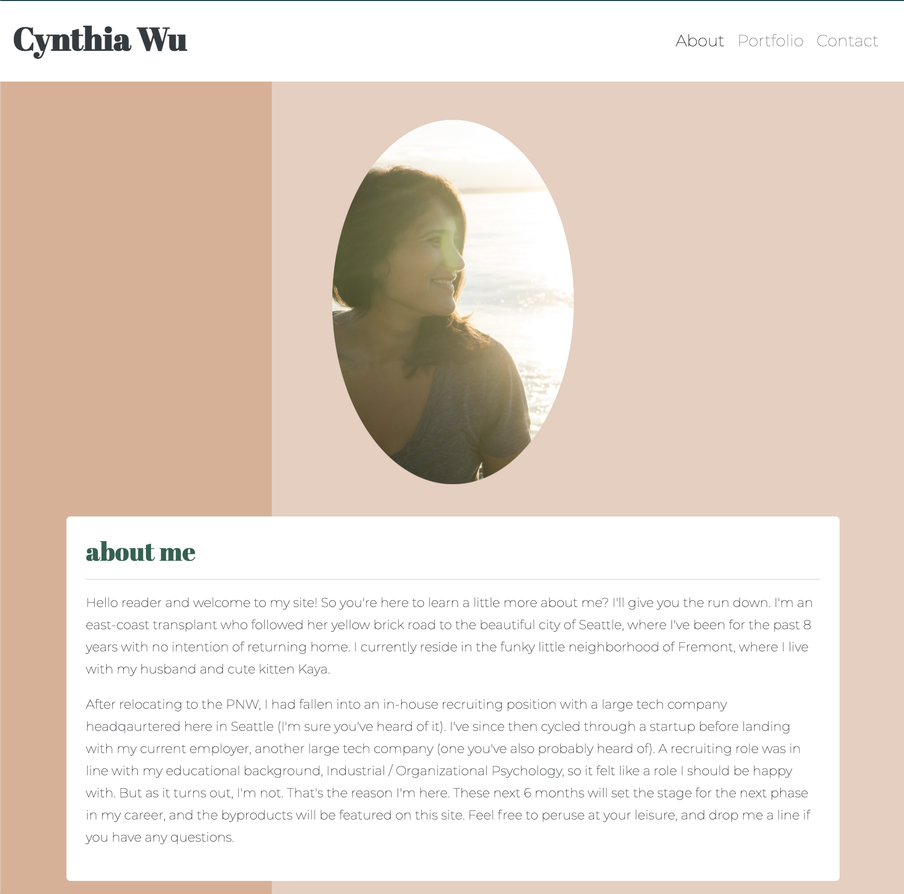
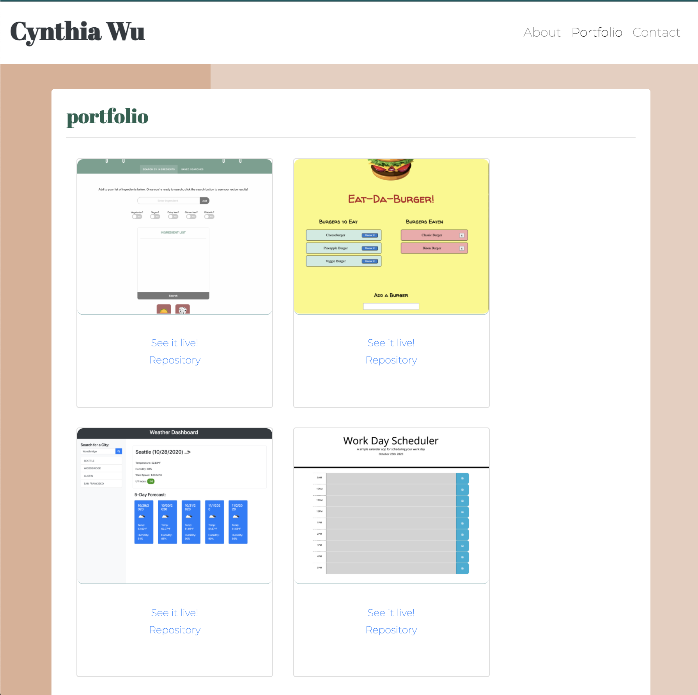
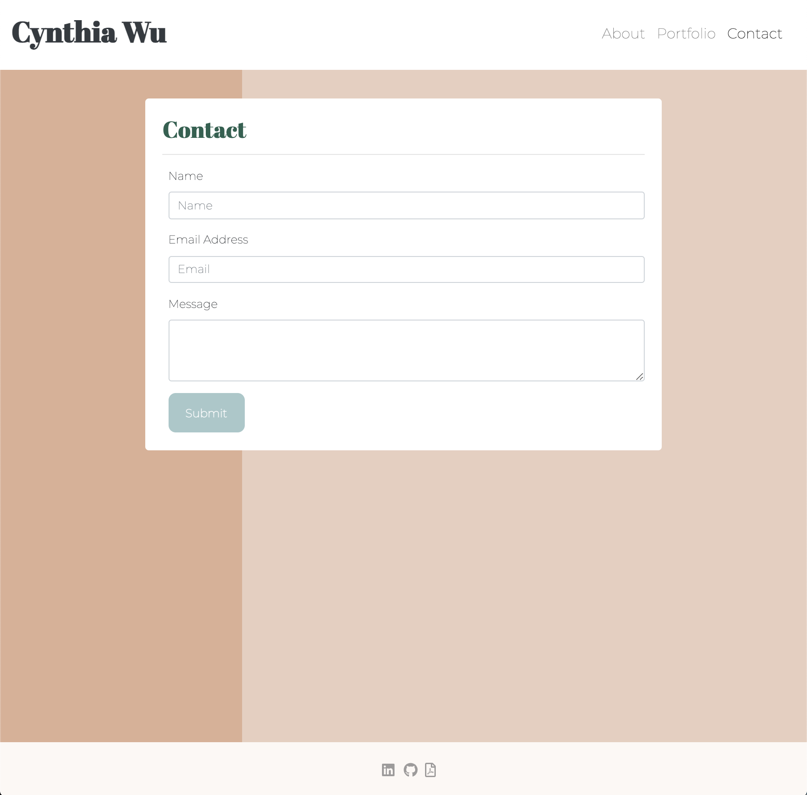

# My Portfolio in React

Explore the [project page](https://github.com/cynthiwu/react-portfolio)

View it live on [GitHub Pages](https://cynthiwu.github.io/react-portfolio/)

## Table of Contents
- [About The Project](#about-the-project)
    - [Built With](#built-with)
- [Installation](#installation)
- [Usage](#usage)
- [Contributing](#contributing)
- [Contact](#contact)


## About The Project

The goal of this project was to rebuild my portfolio using React. The focus was on breaking up the portfolio's pages into components to practice rednering based on user initiated events. 

<hr>



<hr>



<hr>



<hr>

### Built With

This project was built using:

* JavaScript
* [React](https://reactjs.org/)
* React DOM
* React Router DOM
* [Node.js](https://nodejs.org/api/fs.html)
* [Bootstrap] (https://getbootstrap.com/)


## Installation

While not necessary to run the program via the live link above, you may get a local copy up and running by following these simple steps:

1. Clone the repo
```sh
git clone git@github.com:cynthiwu/react-portfolio.git 
```

2. Install NPM packages (i.e., Inquirer)
```sh
npm install
```

## Usage

This project can be used as a demonstration of React components and a framework for manipulating UI based on user action. In addition, it is a good example of the Random User API and how the data can be used. Randomly generated data can be swapped out for user entered data. 

## Contributing

Contributions are what make the open source community such an amazing place to  learn, inspire, and create. Any contributions you make are **greatly appreciated**.

1. Fork the Project
2. Create your Feature Branch (`git checkout -b feature/AmazingFeature`)
3. Commit your Changes (`git commit -m 'Add some AmazingFeature'`)
4. Push to the Branch (`git push origin feature/AmazingFeature`)
5. Open a Pull Request

## Contact

Cynthia Wu - [@cynthia21wu](https://twitter.com/cynthia21wu) - cynthia21wu@gmail.com

Project Link: [https://github.com/cynthiwu/react-portfolio](https://github.com/cynthiwu/react-portfolio)

Live Link: [https://cynthiwu.github.io/react-portfolio/](https://cynthiwu.github.io/react-portfolio/)
